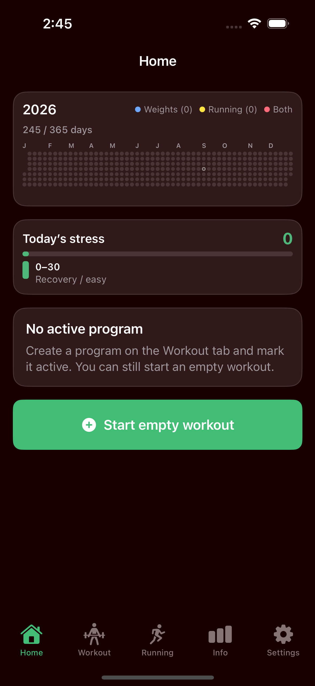
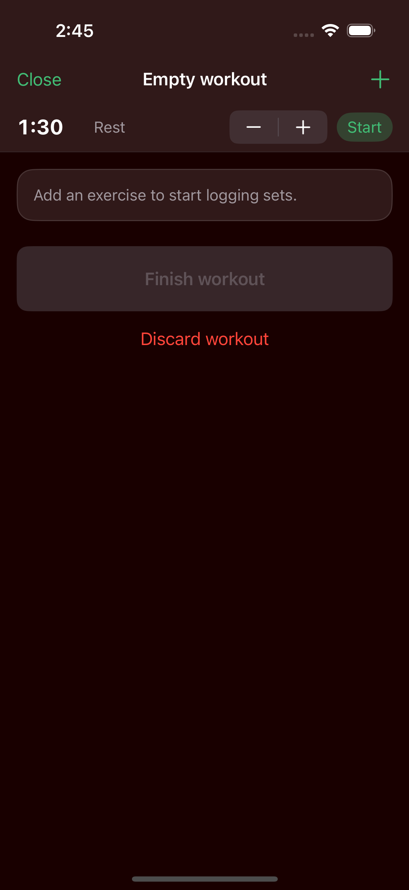
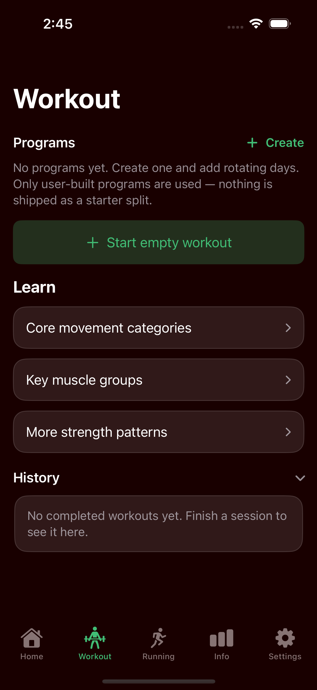
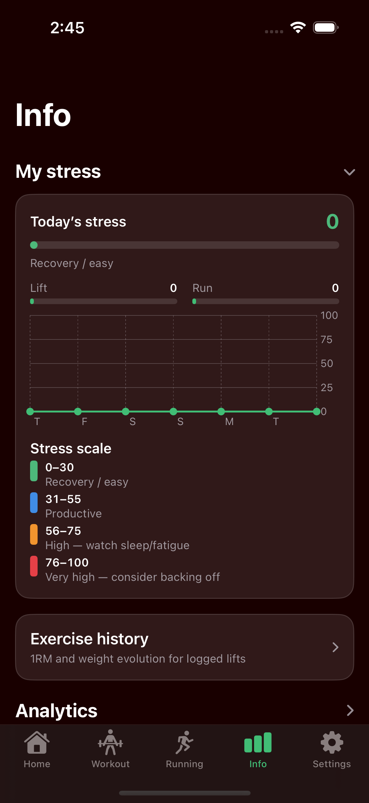
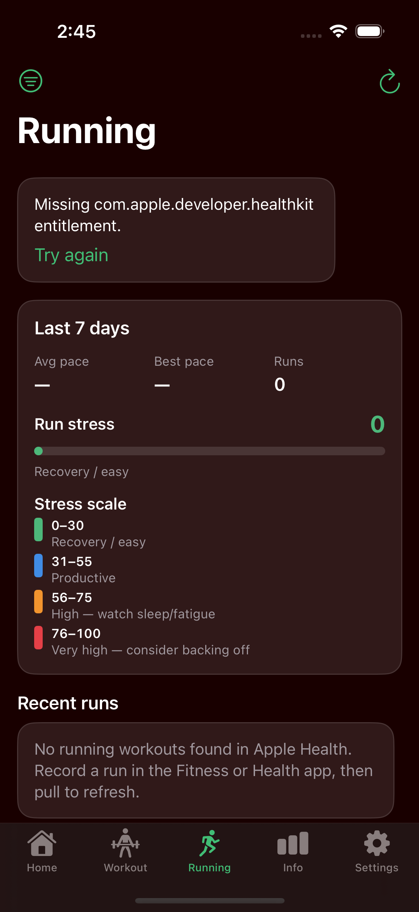
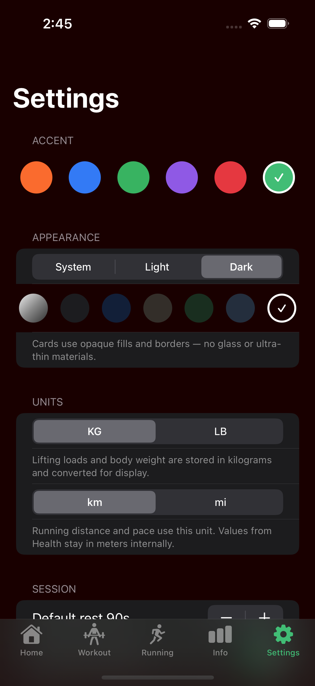

# Workout

A native iPhone app for strength training. Log sessions with a custom keypad and RIR, build rotating programs, follow recovery and volume, and pull runs from Apple Health.

Requires **iOS 17+**.

---

## Screenshots

| Home | Live workout |
|:---:|:---:|
|  |  |

| Workout | Info |
|:---:|:---:|
|  |  |

| Running | Settings |
|:---:|:---:|
|  |  |

---

## Features

### Home
- Year activity grid for **Weights**, **Running**, and **Both**
- Workout count and day-of-year on the year card
- **Today’s stress** under the year overview
- Next workout from your active program, or start an empty session

### Workout logging
- Custom number pad (no system keyboard) with rest timer
- **RIR** on the reps keypad, with an in-session explainer
- Planned vs logged sets (`X out of Y sets done`)
- Edit a logged set’s weight, reps, and RIR without adding a new set
- Plate calculator for barbell and functional-trainer lifts
- Exercise history and estimated **1RM** per movement

### Programs
- Multi-day programs with a rotating next workout
- Sets per exercise while building a day
- Overview after you tap Done: planned sets, muscle breakdown, and split notes

### Learn
- Core movement categories
- Key muscle groups
- More strength patterns
- Related muscles and patterns as separate cards you can tap through

### Info
- Today’s stress and 7-day trend
- 7-day tonnage and reps (totals and per muscle)
- Volume, 1RM, engagement, and intensity charts
- Searchable exercise history
- Sections you can hide from Settings

### Running
- Reads running, walking, hiking, and cycling from **Apple Health**
- Filters, pace and heart-rate charts, route map when GPS exists

### Widgets
- **Year** — small, medium, and large year-in-pixels views
- **Today’s stress** — small and medium
- **Next workout** — small

### Settings
- Custom accent and appearance (including a custom background color)
- Light, dark, or system appearance
- kg/lb and km/mi
- Body weight log synced with Health
- Optional write of finished strength sessions to Apple Health (Traditional Strength Training)
- Export / import JSON backup
- Info-page visibility toggles

---

## Tech stack

| Layer | Choice |
|---|---|
| UI | SwiftUI |
| Persistence | SwiftData |
| Charts | Swift Charts |
| Maps | MapKit |
| Health | HealthKit (cardio read; body mass read/write; optional strength workout write) |
| Home screen | WidgetKit |

---

## App Store

- Privacy strings for HealthKit are in `Info.plist`
- `ITSAppUsesNonExemptEncryption` is `false`
- Strength sessions stay on-device unless the user turns on **Write finished workouts to Apple Health**
- Cardio workouts from Health are read-only
- Replace `com.local.WorkoutApp` with your production bundle ID and App Icon before submit
